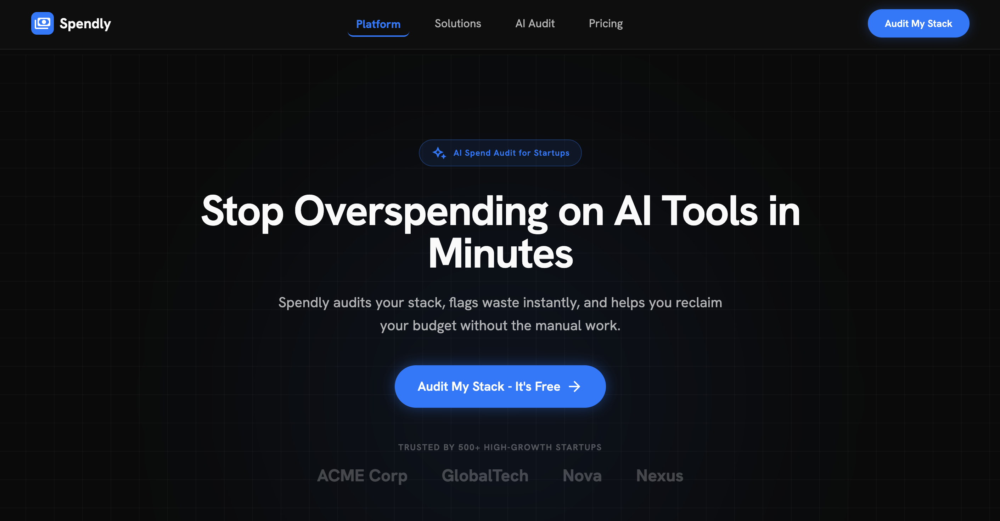
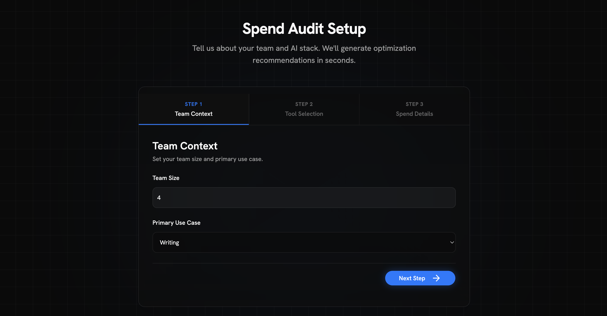
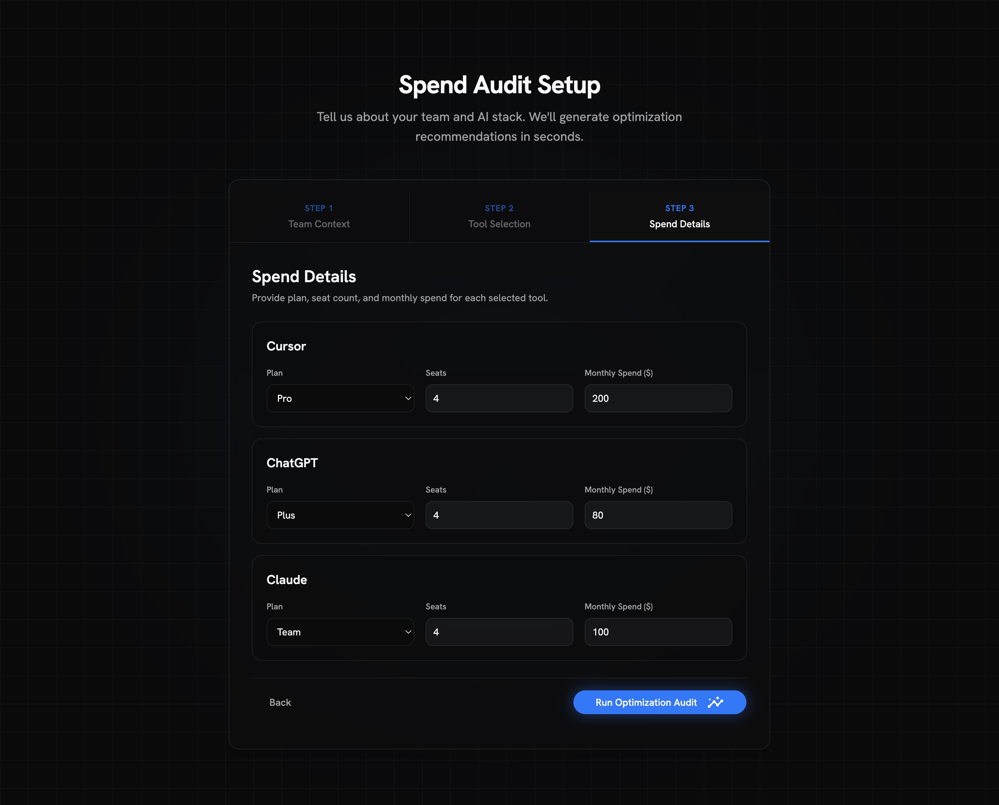
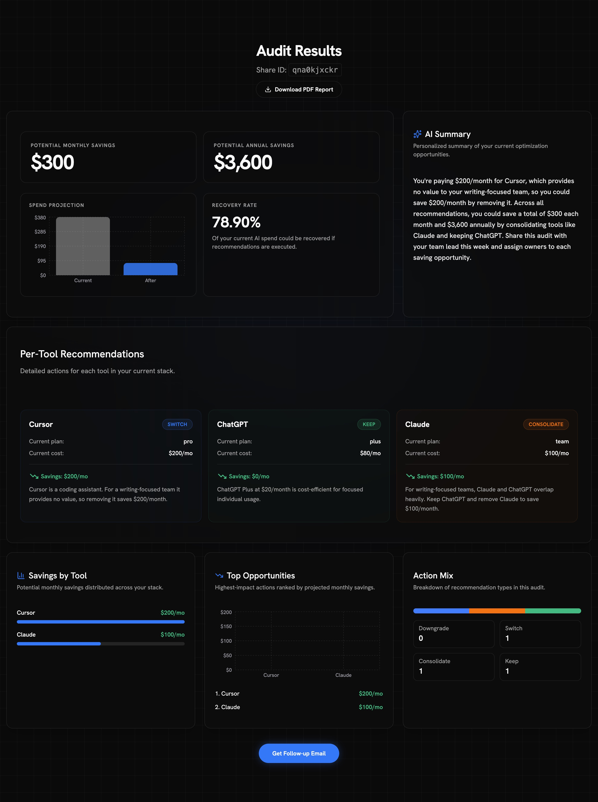

# Spendly

Spendly is a free AI spend audit tool for engineering managers and team leads who need a fast, defensible answer to one question: are we overpaying for AI tools? Users enter their team context and current subscriptions, and Spendly returns a rule-based savings report with per-tool actions, projected monthly/annual impact, and a shareable result URL. It is built for technical decision-makers at early-stage startups who are cost-conscious but still move quickly.

## Screenshots

### Landing Page



### Audit Form — Step 1: Team Context



### Audit Form — Step 2: Tool Selection


### Audit Form — Step 3: Spend Details



### Results Page



## Quickstart

```bash
git clone <your-repo-url>
cd spendly
npm install
cp .env.local.example .env.local
npx prisma db push
npm run dev
```

Open `http://localhost:3000`.

Environment variables are documented in [`.env.local.example`](./.env.local.example).

## Decisions

1. **Prisma over raw Supabase client**
Prisma gives one typed data access layer across server routes (`/api/audit`, `/api/capture`, `/api/report/[id]`) and the results page server component. For this project, the trade-off favored safer refactors and explicit schema evolution over writing direct SQL or mixing query styles.

2. **Rule-based audit engine over AI-generated recommendations**
The core audit decisions are finance-sensitive and must be deterministic, explainable, and testable. A rule engine in `src/lib/auditEngine.ts` keeps recommendations reproducible with exact dollar math, while AI is only used for narrative summarization in `/api/summary`.

3. **Zustand over React Context for form state**
The audit form is a 3-step wizard with cross-step dependencies and persistence requirements. Zustand with `persist` middleware reduced boilerplate, kept actions explicit, and made reload-safe draft recovery simple compared to manually wiring Context + reducers + localStorage sync.

4. **`gpt-4o-mini` over `gpt-4o` for summaries**
Summary generation is a short, bounded operation (3 sentences, constrained prompt, <=150 output tokens). `gpt-4o-mini` provides a better latency/cost profile for this job without impacting the deterministic audit math.

5. **`nanoid` share IDs over UUID**
Spendly needs short, URL-friendly IDs for share links (`/results/[shareId]`) that users can copy, read, and discuss quickly. `nanoid` gives compact 10-character IDs with strong uniqueness and cleaner UX than long UUID strings.

## Deployed URL

`REPLACE WITH VERCEL URL`
